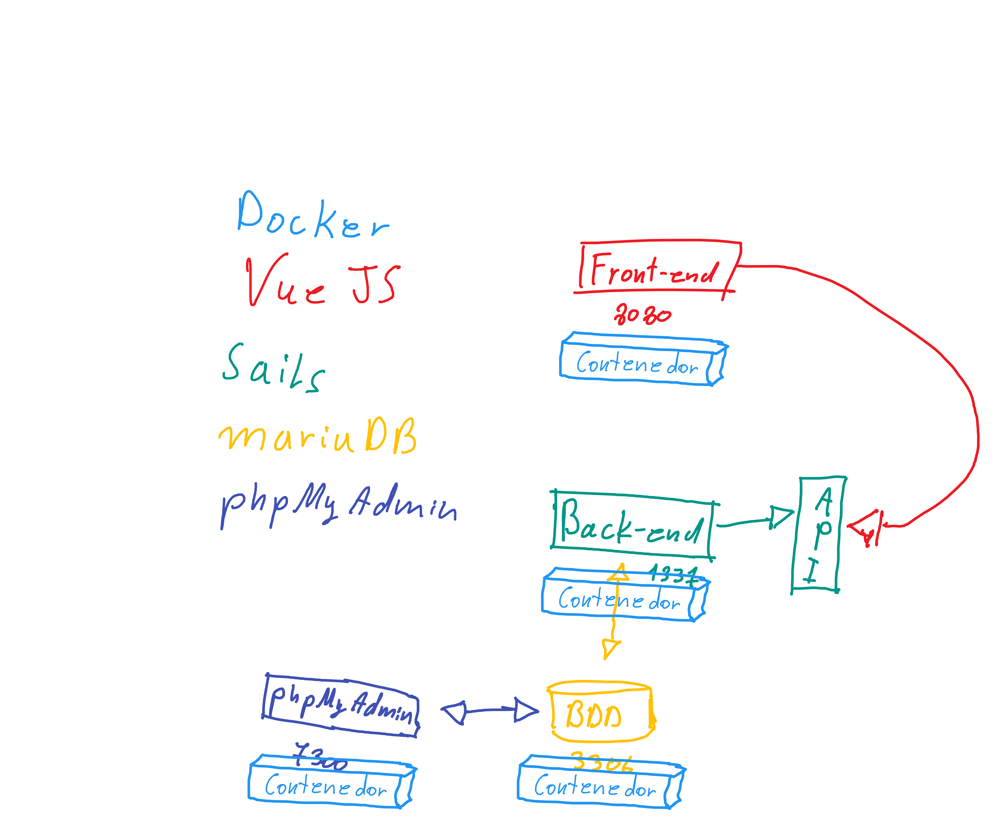

## Dependencias

#### SO

Vamos a usar cualquier distro de linux basado en debian como linux mint, MXLinux (personal favorite), ubuntu y derivados, o debian mismo.

#### Docker
Usaremos docker para levantar la base de datos en mariadb, y phpmyadmin como gestor, para no andar weando con xampp y otras mierdas que pueden pesentar
problemas de compatibilidad.

```
## Descargar docker en:
https://download.docker.com/linux/debian/dists/stretch/pool/stable/amd64/docker-ce_18.06.3~ce~3-0~debian_amd64.deb

## Instalando haciendo doble click o ejecutando el siguiente comando dentro de la carpeta donde se descargo el archivo:
sudo dpkg -i docker-ce_18.06.3_ce_3-0_debian_amd64.deb

```

#### docker-compose

```
## Run this command to download the current stable release of Docker Compose:
sudo curl -L "https://github.com/docker/compose/releases/download/1.24.0/docker-compose-$(uname -s)-$(uname -m)" -o /usr/local/bin/docker-compose

## Apply executable permissions to the binary:

sudo chmod +x /usr/local/bin/docker-compose

## Y por utimo
sudo ln -s /usr/local/bin/docker-compose /usr/bin/docker-compose

```

## Dependencias entorno de desarrollo:

#### ZSH (opcional)

* Si utilizas una "terminal sin complementos" se recomienda el uso de OhMyZsh!. Para instalarlo utiliza el siguiente comando en tu terminal:

```
## Install Zsh
sudo apt install zsh

##Install curl
sudo apt-get install curl

## Install OhMyZsh!
sh -c "$(curl -fsSL https://raw.github.com/robbyrussell/oh-my-zsh/master/tools/install.sh)"

## How to use
zsh

## Or make it your default shell!
chsh -s $(which zsh)

## Logout and log in
```


#### NVM para instalar node y npm

```
## Instalar NVM. Si no instalaste zsh, en el siguiente comando, cambia zsh por bash
wget -qO- https://raw.githubusercontent.com/nvm-sh/nvm/v0.34.0/install.sh | zsh

## Reiniciar terminal

## Instalar node
nvm install v10.16.0

## y finalmente
nvm alias default v10.16.0

```

#### Vue js y Sails

```
## Instalar Vue
npm install -g @vue/cli 

## instalar Sails
npm install sails -g
```

## Despliegue entorno de desarrollo

```
## Clonar el repositorio de este proyecto
git clone git@gitlab.com:NruizG/taller-bdd.git
```

1.  Entrar a la carpeta del proyecto y levantar el archivo docker-compose.yml con el siguiente comando:

```
## Este comando levanta un imagen con al base de datos mariadb y otra phpmyadmin
sudo docker-compose up -d
```

2.  En el navegador entrar al siguiente url: 
```
localhost:7300

username: root
password: shadowfax
```

3. Crear una base de datos llamada "taller_bdd"

4. Entrar a la carpeta 'backend' desde la consola y escribir los siguientes comandos:


```
## Instala los modulos de node:
npm install

## Levanta la aplicacion sails. Cuando pregunte por una opción elegir la Nº 1
sails lift
```

5. Desde la base de datos recien creada importar el archivo sailors_data.sql ubicado en 


`/taller_bdd/backend/migrations/`


6. Entrar a la carpeta frontend desde otra consola y escribir los siguientes comandos:

```
## Instalar modulos
npm install

## Levantar aplicación Vue en modo desarrollo
npm run serve
```

##### NOTA: Esto se hace la primera vez que se ejecuta el entorno. Despues solo es necesario ejecutar el paso 1, levantar sails con la opcion 3, y levantar Vue.

## Representación grafica de la arquitectura del proyecto.

